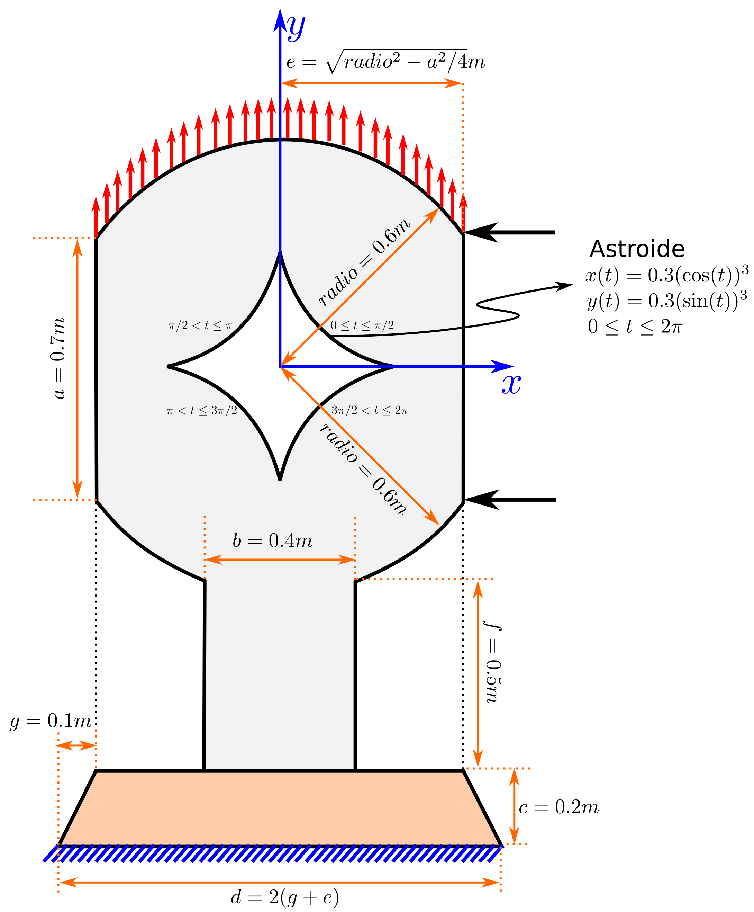

# Ejercicios

## Ejercicio 1 (Creación de la geometría)

- [Geometría](Ejercicio_1/Ejercicio_1.geo)

### Dimensiones

### Propuesta de etiquetas numéricas

## Ejercicio 2 (Creación de la malla de elementos finitos)

- [Geometría](Ejercicio_2/Ejercicio_2.geo)
- [Malla](Ejercicio_2/Ejercicio_2_malla.geo)

### Dimensiones

### Propuesta de etiquetas numéricas

## Ejercicio de malla estructurada

- [Geometría y malla](Malla_estructurada/Malla_estructurada.geo)

### Dimensiones

### Propuesta de etiquetas numéricas

